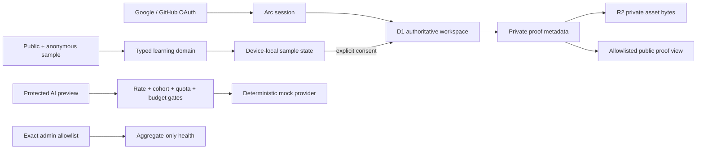

# Arc.


[](https://github.com/Earorua/arc/actions/workflows/ci.yml)
[](https://arc-precision-path.jiahe-xu.chatgpt.site)

**A precision learning system for mastering the technology stack behind a target role.**

Arc. turns a career goal into an attributable skill map, a schedule-aware path, one focused learning session at a time, and an honest picture of capability. It is built as a product—not a course catalog—to demonstrate how restrained design, credible state modeling, and explicit trust boundaries can make a complex journey feel clear.

[Visit the current public site](https://arc-precision-path.jiahe-xu.chatgpt.site) · [Read the Beta Foundation design](./docs/superpowers/specs/2026-07-28-arc-beta-foundation-design.md)

## The product loop

Arc. organizes the learning journey into five connected decisions:

1. **Setup** — define the role, current level, weekly time budget, and target duration.
2. **Path** — distribute the journey across foundations, systems, delivery, and proof.
3. **Today** — complete one focused unit with a concrete artifact.
4. **Stack** — inspect skills, confidence, sources, freshness, and prerequisites.
5. **Proof** — turn completed work into private evidence and selectively publish only chosen fields.

The flagship experience maps 16 skills for an AI full-stack engineer. Custom roles use that transparent sample until live role research is enabled; Arc. says this directly instead of presenting generated claims as researched fact.

## Two honest modes

**Anonymous sample.** Anyone can explore the public story and complete the deterministic flagship path without an account. This mode stays device-local and remains useful when identity, cloud storage, or AI is unavailable.

**Independent Arc. account.** The codebase supports Google and GitHub OAuth owned by Arc.—not ChatGPT identity. After sign-in, D1 is authoritative for learning state. Meaningful work already present on the device is shown as an explicit import choice; it is never silently moved, overwritten, or deleted.

Hosted Google and GitHub primary callbacks have completed real same-origin flows on the deployed URL. Sites version 6 exposes explicit second-provider linking and the non-disclosing conflict recovery state in production. A live GitHub-to-Google linking attempt completed the provider callback but was safely rejected by the current same-email policy before ownership-conflict evaluation; neither account changed. Cross-email linking policy, cancellation, and invalid-state rejection remain release-gate decisions. When hosted credentials are absent, `/api/auth/providers` still reports no available provider and the interface shows a preparation state.

## Design thesis: Warm Precision

Arc. borrows the confidence of editorial publishing rather than the density of a traditional dashboard. Ivory paper, charcoal type, vermilion signals, Newsreader display typography, and restrained motion create a calm hierarchy around the next meaningful action.

The visual system is intentionally image-light. Structure, type, spacing, and language carry the product personality, while keyboard navigation, visible focus, reduced-motion behavior, mobile workspace controls, and actionable recovery states remain part of the core experience.

## Architecture



| Layer | Current choice | Responsibility |
| --- | --- | --- |
| Product UI | React 19, Next-compatible App Router | Public story, account experience, learning workspace, recovery, and read-only operations |
| Runtime | Vinext, Vite 8, Cloudflare-compatible worker | Edge-compatible server rendering, APIs, and response safety headers |
| Identity | Better Auth with Google and GitHub adapters | Independent Arc. sessions; credentials remain server-only |
| Durable state | Cloudflare D1 with Drizzle migrations | Signed-in goals, events, proofs, idempotency, quota ledger, and sanitized operations |
| Private files | Cloudflare R2 | Owner-scoped proof bytes; D1 stores searchable ownership metadata |
| Anonymous state | Guarded browser storage | Device-local sample, explicit migration source, and capped offline mutation queue |
| Intelligence | Typed gateway + deterministic mock provider | Structured output validation, one repair maximum, and a provider-replaceable boundary |
| Controls | D1 rate limits and cohort flag + runtime limits | Per-user quota, global budget, release cohort, and emergency kill switch |
| Quality | Vitest, Testing Library, TypeScript, ESLint, rendered HTML checks | Domain behavior, access control, privacy, accessibility, and production confidence |
| Delivery | GitHub Actions and OpenAI Sites | Reviewable checks, logical D1/R2 bindings, versioned publishing, and rollback |

## Trust boundaries

- Public editorial routes and the anonymous deterministic sample do not require sign-in.
- Signed-in state is accepted only from the server-derived Arc. session; browser requests never select a user ID.
- D1 becomes authoritative after sign-in. Device-local work is imported only after explicit consent and conflict resolution.
- Proof assets are private in R2. Retrieval first proves ownership through D1 and never accepts an object key from the caller.
- A public proof token stores only a SHA-256 hash at rest and exposes only the fields the owner selected. Revocation disables the database record; public routes never serve R2 bytes.
- The browser never receives OAuth secrets, session secrets, or future model credentials. Real values belong only in hosted server-side secret management.
- Live model access is still disabled. The current AI route uses a deterministic mock and no paid provider key.
- Any future paid call must pass identity, endpoint rate limiting, the runtime kill switch, the D1 release cohort, per-user quota, and the global budget ceiling before a reservation is issued.
- Failed or invalid AI output produces no accepted user-facing charge. Operational records contain sanitized metadata, not prompts, role descriptions, proof bodies, tokens, or credentials.
- `/admin` is read-only, exact-email allowlisted, and aggregate-only; it cannot browse learner content or identity records.

## Hosted Beta status

The Sites project is public with server-managed runtime configuration, logical `DB` and `PROOF_ASSETS` bindings, and the reviewed migration. Both providers can create an independent Arc. session and preserve it across navigation. Version 6 is publicly deployed and its authenticated linking entry point is present. The first live linking attempt proved the no-change recovery path but exposed a deliberate same-email policy mismatch with the desired cross-provider flow. Final release remains gated on resolving that policy, cancellation and invalid-state rejection, private proof retrieval, cross-user denial, and the remaining rollback smoke checks.

The version preceding the current Beta candidate remains available as the rollback target until those checks pass. If Sites cannot preserve secure same-origin OAuth cookies and callbacks, the same browser contract can move to the approved owner-controlled Cloudflare deployment branch.

See [the OAuth feasibility record](./docs/operations/sites-oauth-feasibility.md) for the exact hosted validation status.

## Local development

Requires Node.js `>=22.13.0`.

```bash
npm install
npm run dev
```

Copy `.env.example` to a local ignored environment file only when exercising server features. Keep credential values out of source control. The deterministic public sample and test suite require no OAuth or model key.

## Verification

```bash
npm run test:unit
npm run lint
npx tsc --noEmit
npm run build
node --test tests/rendered-html.test.mjs
```

CI runs the unit, lint, production-build, and rendered-HTML gates on pull requests and pushes to `master`.

## Focused roadmap

1. **Hosted Beta validation** — wire Sites-managed D1/R2 resources, apply the reviewed migration, and validate both OAuth providers with owner credentials.
2. **Live role intelligence** — add the first owner-funded server provider behind the existing typed gateway, evidence model, quota, budget, cohort, and kill-switch controls.
3. **Adaptive planning** — replace the transparent flagship fallback with sourced role research while keeping dependency ordering and time allocation deterministic.
4. **Independent home** — attach a custom domain and move the same portable worker to the owner's Cloudflare account when product scale or identity control requires it.
