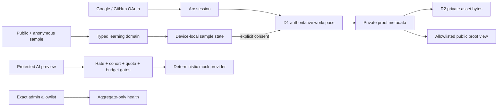

# Arc.


[](https://github.com/Earorua/arc/actions/workflows/ci.yml)
[](https://arc-precision-path.jiahe-xu.chatgpt.site)

**A precision learning system for mastering the technology stack behind a target role.**

Arc. turns a career goal into an attributable skill map, a schedule-aware path, one focused learning session at a time, and an honest picture of capability. It is built as a product—not a course catalog—to demonstrate how restrained design, credible state modeling, and explicit trust boundaries can make a complex journey feel clear.

[Visit the current public site](https://arc-precision-path.jiahe-xu.chatgpt.site) · [Read the Beta Foundation design](./docs/superpowers/specs/2026-07-28-arc-beta-foundation-design.md)

## The product loop

Arc. organizes the learning journey into five connected decisions:

1. **Setup** — choose the role, assess each Flagship skill, record optional evidence metadata, set availability, and choose an honest scope.
2. **Path** — follow a dependency-ordered route with explicit calibration and deferred-skill rationale.
3. **Today** — complete one focused deliverable inside a rolling seven-day plan and review any proposed replan.
4. **Stack** — inspect skills, curated claim confidence, sources, freshness, and prerequisites.
5. **Proof** — turn completed work into private evidence and selectively publish only chosen fields.

The flagship experience maps 16 skills for an AI full-stack engineer. The v8 adaptive flow is Flagship-only. Custom roles continue to use the v7 proportional route and transparent sample text until live role research is separately implemented; Arc. does not present generated claims as researched fact.

## v8 Phase 1 + Phase 2 boundary — local engineering candidate

Phase 1 adds a canonical, versioned intelligence contract for the built-in Flagship role. Each learning resource carries its language, cost, format, source tier, and last verification date, and Stack renders that evidence alongside prerequisites and mastery criteria. Stack's confidence value is confidence in the curated role claim; it is not a score of the learner's mastery, readiness, Proof status, or verification.

The candidate's `GET /api/intelligence/flagship` endpoint is public, read-only, and guest-safe. It serves only the schema- and policy-validated built-in Flagship blueprint, without reading a session or user identifier. The Stack page consumes the same deterministic built-in source directly, so the guest path has no network or model dependency.

Phase 2 is implemented on the isolated local `codex/v8-adaptive-planning` branch. It adds strict planning contracts, a curated 48-unit Registry, deterministic path and calendar primitives, a rolling seven-day scheduler, event-sourced replanning with full diffs, guarded guest storage, owner-scoped D1 persistence and APIs, resumable device import, and adaptive Setup, Path, and Today surfaces. The same Flagship inputs and event stream are parity-tested across local and cloud adapters. Custom roles do not instantiate this adaptive path.

The final local engineering candidate at implementation commit `19b8c87` passed 96 test files / 1093 tests, TypeScript, ESLint, all 5 vinext build environments, 3 rendered-HTML checks, and zero-match secret/provider scans. Independent specification and quality/security reviews both concluded Critical 0 / Important 0 / Minor 0. This is engineering evidence for user acceptance, not evidence of a public release.

Skill levels are learner self-assessment. Optional evidence is learner-supplied public-link metadata only: Arc. does not fetch, review, upload, demonstrate, or verify it, and Phase 2 does not modify Proof state or grant `verified` status.

`drizzle/0002_product_intelligence.sql` and `drizzle/0003_adaptive_planning.sql` are generated local migration artifacts. Neither has been applied to production. Live Research Beta remains disabled: the deterministic Flagship planning path does not require or read `OPENROUTER_API_KEY` and makes no OpenRouter request. Phase 2 has not been merged, pushed, feature-flagged, migrated, or deployed; this section describes a local engineering candidate awaiting user acceptance. The public Sites URL still serves Arc. v7.2 / Sites version 9.

## Two honest modes

**Anonymous sample.** Anyone can explore the public story and complete the deterministic flagship path without an account. This mode stays device-local and remains useful when identity, cloud storage, or AI is unavailable.

**Independent Arc. account.** The codebase supports Google and GitHub OAuth owned by Arc.—not ChatGPT identity. After sign-in, D1 is authoritative for learning state. Meaningful work already present on the device is shown as an explicit import choice; it is never silently moved, overwritten, or deleted.

Production currently serves Arc. product v7.2 as Sites version 9; Sites version 6 is the direct rollback baseline. Real same-origin evidence has passed for primary Google and GitHub sign-in and sign-out, current-provider reauthentication, user cancellation, stale-grant rejection, owned-target no-merge isolation, and persistent device-migration dismissal. Safe unowned-target linking, replay and application-bypass evidence, observable account-link event-log evidence, and post-link account and learning-state continuity remain open. When hosted credentials are absent, `/api/auth/providers` still reports no available provider and the interface shows a preparation state.

## Design thesis: Warm Precision

Arc. borrows the confidence of editorial publishing rather than the density of a traditional dashboard. Ivory paper, charcoal type, vermilion signals, Newsreader display typography, and restrained motion create a calm hierarchy around the next meaningful action.

The visual system is intentionally image-light. Structure, type, spacing, and language carry the product personality, while keyboard navigation, visible focus, reduced-motion behavior, mobile workspace controls, and actionable recovery states remain part of the core experience.

## Architecture



| Layer | Current choice | Responsibility |
| --- | --- | --- |
| Product UI | React 19, Next-compatible App Router | Public story, account experience, learning workspace, recovery, and read-only operations |
| Runtime | Vinext, Vite 8, Cloudflare-compatible worker | Edge-compatible server rendering, APIs, and response safety headers |
| Identity | Better Auth with Google and GitHub adapters | Independent Arc. sessions; credentials remain server-only |
| Durable state | Cloudflare D1 with Drizzle migrations | Signed-in goals, events, proofs, idempotency, quota ledger, and sanitized operations |
| Private files | Cloudflare R2 | Owner-scoped proof bytes; D1 stores searchable ownership metadata |
| Anonymous state | Guarded browser storage | Device-local sample, explicit migration source, and capped offline mutation queue |
| Intelligence | Versioned Flagship contract + deterministic mock preview | Validated, no-network Flagship reads today; a provider-replaceable boundary for later research |
| Adaptive planning | Versioned Registry + deterministic event-sourced kernel | Flagship-only audit, path, seven-day plan, Today session, diff review, replay, and local/cloud parity |
| Controls | D1 rate limits and cohort flag + runtime limits | Per-user quota, global budget, release cohort, and emergency kill switch |
| Quality | Vitest, Testing Library, TypeScript, ESLint, rendered HTML checks | Domain behavior, access control, privacy, accessibility, and production confidence |
| Delivery | GitHub Actions and OpenAI Sites | Reviewable checks, logical D1/R2 bindings, versioned publishing, and rollback |

## Trust boundaries

- Public editorial routes and the anonymous deterministic sample do not require sign-in.
- Signed-in state is accepted only from the server-derived Arc. session; browser requests never select a user ID.
- D1 becomes authoritative after sign-in. Device-local work is imported only after explicit consent and conflict resolution.
- Proof assets are private in R2. Retrieval first proves ownership through D1 and never accepts an object key from the caller.
- A public proof token stores only a SHA-256 hash at rest and exposes only the fields the owner selected. Revocation disables the database record; public routes never serve R2 bytes.
- The browser never receives OAuth secrets, session secrets, or future model credentials. Real values belong only in hosted server-side secret management.
- Live model access is still disabled. The protected legacy AI preview uses a deterministic mock, while the v8 Flagship intelligence and planning paths use validated built-in data only. Neither path requires `OPENROUTER_API_KEY`.
- Phase 2 evidence fields are self-reported metadata, not Arc verification. Planning completion never writes legacy Proof verification state.
- Any future paid call must pass identity, endpoint rate limiting, the runtime kill switch, the D1 release cohort, per-user quota, and the global budget ceiling before a reservation is issued.
- Failed or invalid AI output produces no accepted user-facing charge. Operational records contain sanitized metadata, not prompts, role descriptions, proof bodies, tokens, or credentials.
- `/admin` is read-only, exact-email allowlisted, and aggregate-only; it cannot browse learner content or identity records.

## Hosted Beta status

The Sites project is public with server-managed runtime configuration, logical `DB` and `PROOF_ASSETS` bindings, and the reviewed production v7 19-table migration. The deployed production product is Arc. v7.2, saved and deployed as Sites version 9. Primary Google and GitHub flows, current-provider reauthentication, cancellation, stale-grant rejection, owned-target isolation, and persistent migration dismissal have passed. Safe unowned-target linking, replay/application-bypass evidence, account-link event-log evidence, and post-link continuity remain open.

Sites version 6 remains the direct rollback baseline. The v8 Phase 1 + Phase 2 candidate is not deployed; `drizzle/0002_product_intelligence.sql` and `drizzle/0003_adaptive_planning.sql` remain unapplied in production. If Sites cannot preserve secure same-origin OAuth cookies and callbacks, the same browser contract can move to the approved owner-controlled Cloudflare deployment branch.

See [the OAuth feasibility record](./docs/operations/sites-oauth-feasibility.md) for the exact hosted validation status.

## Local development

Requires Node.js `>=22.13.0`.

```bash
npm install
npm run dev
```

Copy `.env.example` to a local ignored environment file only when exercising server features. Keep credential values out of source control. The deterministic public sample, v8 Flagship intelligence/planning paths, and test suite require no OAuth or model key; `OPENROUTER_API_KEY` is reserved for the later Research Beta phase.

## Verification

```bash
npm run test:unit
npm run lint
npx tsc --noEmit
npm run build
node --test tests/rendered-html.test.mjs
```

CI runs the unit, lint, production-build, and rendered-HTML gates on pull requests and pushes to `master`.

## Focused roadmap

1. **Hosted Beta validation** — complete the private R2 Proof put/get and compensation smoke, then close safe unowned-target linking, replay/application-bypass, account-link event-log, and post-link continuity evidence.
2. **Live role intelligence** — add the first owner-funded server provider behind the existing typed gateway, evidence model, quota, budget, cohort, and kill-switch controls.
3. **Adaptive planning expansion** — after Phase 2 acceptance, plan the separately scoped Proof-backed Stack and later sourced-role research while keeping dependency ordering and time allocation deterministic.
4. **Independent home** — attach a custom domain and move the same portable worker to the owner's Cloudflare account when product scale or identity control requires it.
