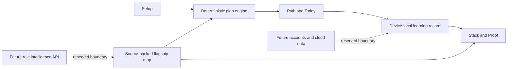

# Arc.


[](https://github.com/Earorua/arc/actions/workflows/ci.yml)
[](https://arc-precision-path.jiahe-xu.chatgpt.site)

**A precision learning path for mastering the technology stack behind a target role.**

Arc. turns a career goal into an attributable skill map, a schedule-aware path, one focused learning session at a time, and an honest picture of capability. It is built as a product—not a course catalog—to demonstrate how restrained design, credible data, and careful state modeling can make a complex journey feel clear.

[Visit Arc.](https://arc-precision-path.jiahe-xu.chatgpt.site) · [Read the product design](./docs/superpowers/specs/2026-07-26-arc-career-learning-platform-design.md)

## The experience

Arc. organizes the learning journey into five connected decisions:

1. **Setup** — define the role, current level, weekly time budget, and target duration.
2. **Path** — distribute the journey across foundations, systems, delivery, and proof.
3. **Today** — complete a focused 45-minute unit with a concrete artifact.
4. **Stack** — inspect skills, confidence, sources, freshness, and prerequisites.
5. **Proof** — separate device-local learning coverage from externally verified role readiness.

The flagship experience maps 16 skills for an AI full-stack engineer. Custom roles reuse that transparent sample until the future intelligence layer is connected; the interface says so instead of pretending that live research has already happened.

## Design thesis: Warm Precision

Arc. borrows the confidence of editorial publishing rather than the density of a traditional dashboard. Ivory paper, charcoal type, vermilion signals, Newsreader display typography, and restrained motion create a calm hierarchy around the next meaningful action.

The visual system is intentionally image-light. Structure, type, spacing, and language carry the product personality, while the interface preserves keyboard navigation, visible focus, reduced-motion behavior, and mobile-first workspace controls.

## Architecture



| Layer | Current choice | Purpose |
| --- | --- | --- |
| Product UI | React 19, Next-compatible App Router | Public story and multi-step workspace |
| Runtime | Vinext, Vite 8, Cloudflare-compatible worker | Fast local development and portable deployment |
| Domain | TypeScript models and deterministic transforms | Explainable schedules, progress, and readiness |
| State | Browser local storage with guarded writes | Durable demo behavior without an account |
| Data seams | Drizzle schema, D1/R2-compatible structure | Reserved server-side persistence and evidence storage |
| Quality | Vitest, Testing Library, ESLint, rendered HTML checks | Behavior, accessibility contracts, and production confidence |
| Delivery | GitHub Actions and OpenAI Sites | Reproducible checks and a public product URL |

## Trust boundaries

The current release is a deterministic, device-local flagship demo:

- It does not call a live model or require an API key.
- Learning configuration, progress, and evidence stay on the current device.
- It does not provide login, cross-device sync, or evidence uploads yet.
- Local completion coverage is never presented as externally verified job readiness.
- Future model credentials will belong in server-side secrets, never browser code.

These boundaries keep the demo usable now while leaving deliberate integration points for role research, citations, accounts, and durable evidence.

## Local development

Requires Node.js `>=22.13.0`.

On macOS, Linux, or another Unix-like shell:

```bash
npm install
npm run dev
```

The scripts use POSIX-style environment variables. In Windows PowerShell, run them with Git Bash as npm's script shell:

```powershell
npm install
npm --script-shell="C:\Program Files\Git\bin\bash.exe" run dev
```

## Verification

On macOS, Linux, or another Unix-like shell:

```bash
npm run test:unit
npm run lint
npm run build
node --test tests/rendered-html.test.mjs
```

In Windows PowerShell, the build uses the same Git Bash script shell:

```powershell
npm run test:unit
npm run lint
npm --script-shell="C:\Program Files\Git\bin\bash.exe" run build
node --test tests/rendered-html.test.mjs
```

## Focused roadmap

1. **Role intelligence** — research current job requirements through a server-side model provider, retain source attribution, and expose confidence and freshness.
2. **Durable identity** — add authentication and D1-backed cross-device learning state.
3. **Evidence graph** — connect projects, repositories, and reviewed artifacts to externally verifiable readiness.
4. **Independent home** — attach a custom domain and, when the server-side product expands, move the same Cloudflare-compatible build into an owner-controlled cloud account.
